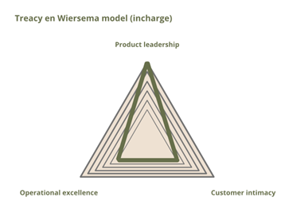
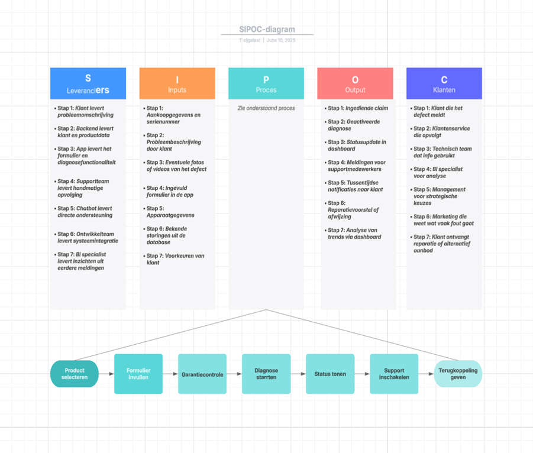
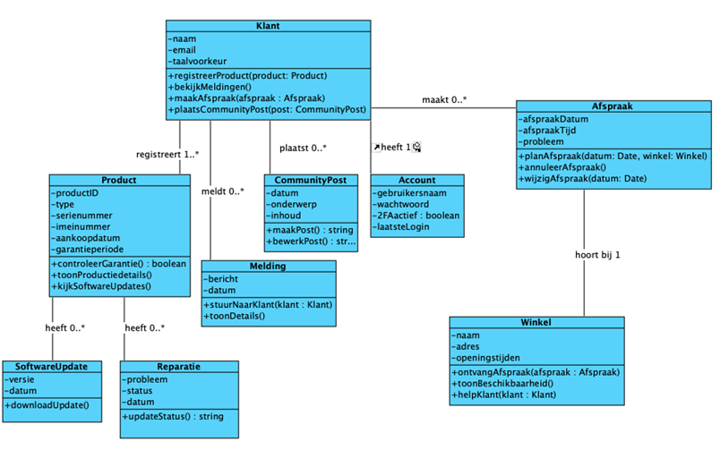

# Inhoudsopgave

  Versiebeheer
    
1.  Organisatorische Context
    
    -   1.2 Missie
        
    -   1.3 Visie
        
    -   1.4 Strategie
        
	    -   1.4.1 Toelichting op waardediciplines van Treacy en Wiersema
        
    -   1.5 Doelstellingen
        
    -   1.6 Organogram
        
2.  Actoren

   -   2.1 Stakeholders
     
   -   2.2 Actoren
    
3.  Bedrijfsprocesanalyse
    
4.  Productvisie
    
    -   4.1 Uitleg vision board
        
5.  Systeemontwerp

   -  5.1 User stories
     
   -  5.2 MoSCoW: Prioritering van user stories
     
   -  5.3 Minimum viable product
    
6.  Definition van Ready en Done
    
    -   6.1 Definition of Ready
        
    -   6.2 Definition of Done
        
8.  Domeinmodel
    
9.  Klassendiagram
    
10.  Sitemap
    
11.  Wireframes

# Versiebeheer
| Versienummer | Datum   | Auteur             | Wijziging                                            | Gecontroleerd door |
| ------------ | ------- | ------------------ | ---------------------------------------------------- | ------------------ |
| 0.1          | 12-5-25 | Christian          | Organisatorische context                             |                    |
| 0.2          | 12-5-25 | Twan               | Organogram                                           |                    |
| 0.3          | 12-5-25 | Calvin             | Definition of done en definition of ready geschreven |                    |
| 0.4          | 12-5-25 | Twan               | SIPOC                                                |                    |
| 0.5          | 12-5-25 | Christian & Calvin | Systeemontwerp                                       |                    |
| 0.6          | 12-5-25 | Luke               | Actoren                                              |                    |
| 0.7          | 15-5-25 | Christian          | Wireframes                                           |                    |
| 0.8          | 15-5-25 | Calvin             | Domeinmodel                                          |                    |
| 0.9          | 15-5-25 | Calvin             | Klassendiagram                                       |                    |
| 0.91         | 16-5-25 | Twan               | SIPOC Info toegevoegd                                |                    |
| 0.92         | 16-5-25 | Twan               | Word omgezet naar Markdown                           |                    |
| 0.93         | 16-5-25 | Luke               | Productvisie                                         |                    |
| 0.94         | 16-5-25 | Thomas             | Sitemap                                              |                    |
| 1.3          | 30-5-25 | Christian          | MoSCoW-tabel                                         | Calvin             |
| 1.4          | 30-5-25 | Christian          | Sitemap aangepast                                    | Calvin             |
| 1.5          | 30-5-25 | Christian          | Wireframes aangepast                                 | Twan, Luke         |
| 1.6          | 30-5-25 | Christian          | Sitemap aangepast                                    | Calvin             |
| 1.7          | 30-5-25 | Calvin             | Domeinmodel, klassendiagram aangepast en MVP gedefinieerd | Chris         |
| 1.8          | 4-6-25  | Luke               | Actoren                                              | Twan |
| 1.9          | 4-6-25  | Twan               | Omgezet naar markdown                                | Christian |         |        

# Organisatorische Context

## 1.2 | Missie

Wij ontwikkelen smartphones van hoge kwaliteit met een lange batterijduur. Ons doel is om mensen wereldwijd betrouwbare telefoons te bieden waar ze elke dag op kunnen rekenen.

## 1.3 | Visie

Incharge wil internationaal bekend staan als een merk dat focust op kwaliteit en duurzaamheid. We streven ernaar om klanten kwaliteit aan te bieden wat ze nog niet eerder hebben meegemaakt.

## 1.4 | Strategie

Het model van Treacy en Wiersema helpt organisaties om een duidelijke strategische focus te kiezen op basis van drie waardedisciplines: operational excellence, product leadership en customer intimacy. Door te bepalen welke discipline het beste past bij de visie en ambities van de organisatie, kan Incharge zich scherp positioneren ten opzichte van concurrenten. (Eichen, 2006)  
Voor incharge is dit model gebruikt om de strategisch positionering te bepalen. De gekozen waardestrategie past goed bij het merk en de gewenste positie in de markt. (zie figuur 1).

**Figuur 1: Waardediciplines volgens Treacy en Wiersema**

## 1.4.1 | Toelichting op waardediciplines van Treacy en Wiersema

Incharge richt zich voornamelijk op product leadership. Dat betekent dat we ons willen onderscheiden door voortdurende innovatie en de hoogste productkwaliteit binnen het segment.

Voor incharge betekent 'kwaliteit' méér dan alleen een lange batterijduur. Het staat voor betrouwbaarheid in dagelijks gebruik, hoogwaardige materialen, een strak en tijdloos design. Door hierin te excelleren, wil Incharge niet alleen opvallen, maar een standaard zetten binnen het premiumsegment.

## 1.5 | Doelstellingen

incharge streeft ernaar om binnen vijf jaar een toonaangevende speler te worden in de premium smartphone markt van Europa, Noord-Amerika en Azië, met een sterke focus op uitzonderlijke batterijduur en productkwaliteit. Het bedrijf wil technologische leiderschap behouden via intensieve R&D, efficiënt uitbreiden naar groeimarkten en door scherpe marketing en logistieke optimalisatie een duurzaam concurrentievoordeel opbouwen.

## 1.6 | Organogram

# 2. Actoren

### 2.1 | Stakeholders

In het InCharge-project zijn verschillende stakeholders betrokken die ieder hun eigen belang hebben bij het functioneren van de app. Onderstaande tabel geeft per stakeholder aan wat hun rol is en wat hun belang is bij het project.

| Stakeholder      | Rol                                 | Belang / Doel                                                                 |
|------------------|--------------------------------------|--------------------------------------------------------------------------------|
| Klant            | Eindgebruiker van de app             | Gebruiksgemak, inzicht in aankoop, garantie, updates en aanbiedingen          |
| Klantenservice   | Ondersteunt klanten                  | Efficiënt kunnen communiceren, klanttevredenheid verhogen                     |
| AI Chatbot       | Eerste aanspreekpunt voor klantvragen| Vangt standaardvragen op, ontlast de serviceafdeling                          |
| Technisch team   | Onderhoud app & technische werking   | App betrouwbaar houden, bugs oplossen, updates uitvoeren                      |
| Contentbeheerder | Beheer van inhoud in app             | Tutorials en uitlegpagina's actueel houden                                    |
| Marketingteam    | Promoties en aanbiedingen ontwikkelen| Personalisatie en conversie verhogen                                          |
| Beheerder        | Gebruikers- en privacybeheer         | Veiligheid waarborgen, voldoen aan wetgeving                                  |
| BI Specialist    | Analyseert gebruikersdata            | Inzichten verzamelen voor productontwikkeling en strategie                    |
| Productmanager   | Stuurt ontwikkelingsteam aan         | Prioriteiten stellen, deadlines halen                                         |
| Ontwikkelaars    | Bouwen en verbeteren van de app      | Nieuwe functies realiseren, integraties bouwen, app beveiligen                |

### 2.2 | Actoren

## Actoren in de mobiele app van incharge

In de mobiele app van InCharge zijn verschillende actoren actief die ieder een specifieke rol vervullen in het gebruik en beheer van het systeem. Deze actoren kunnen mensen of systemen zijn die interactie hebben met de app en daarmee bijdragen aan de werking en gebruikerservaring.

De onderstaande tabel geeft per actor een overzicht van:

- Hun rol binnen de app  
- De taken die zij uitvoeren  
- Welke functie hieraan gekoppeld is  
- Wie deze rol vervult binnen of buiten de organisatie  
- Hoe vaak de interactie met de app plaatsvindt  

Deze structuur helpt om alle actoren in kaart te brengen en vormt de basis voor het ontwerp van use cases, user stories en systeemarchitectuur.

| Actor             | Omschrijving                                                                                                                                   | Gekoppelde Functies       | Wie vervult de Rol?                | Frequentie                          |
|------------------|--------------------------------------------------------------------------------------------------------------------------------------------------|----------------------------|------------------------------------|-------------------------------------|
| Klant (Gebruiker) | Gebruikt de app om producten te registreren, ondersteuning te krijgen, garantie te beheren, promoties te bekijken en oude telefoons in te leveren. | Eindgebruiker              | Consument / gebruiker              | Dagelijks gebruik                   |
| Klantenservice    | Beantwoordt klantvragen en beheert garantie- of reparatieverzoeken.                                                                            | Klantenservice medewerker  | Medewerker klantenservice          | Bij incidenten of vragen            |
| AI Chatbot        | Automatisch systeem dat standaardvragen opvangt en basisinstructies geeft.                                                                     | Virtuele assistent         | Geautomatiseerd systeem            | Altijd beschikbaar                  |
| Technisch beheer  | Voert updates uit, analyseert fouten, onderhoudt integraties met andere systemen.                                                              | Ontwikkelaar / IT beheer   | IT team                            | Wekelijks / bij releases            |
| Contentbeheer     | Beheert handleidingen, tutorials en andere content in de app.                                                                                  | Contentbeheerder           | Marketing / support                | Maandelijks / bij updates           |
| Marketingteam     | Beheert promoties, aanbiedingen en community elementen.                                                                                        | Marketeer                  | Marketingteam                      | Bij campagnes                       |
| Beheerder         | Verantwoordelijk voor gebruikersbeheer, privacybeleid en technische instellingen.                                                              | Admin / beheerder          | Technisch team / management        | Bij wijziging gebruikersdata/beleid |
| BI Specialist     | Verzamelt en analyseert data voor rapportages en verbetering.                                                                                  | Data-analist               | Business intelligence team         | Kwartaal                            |
| Productmanager    | Stelt prioriteiten, coördineert development en bewaakt roadmap.                                                                                 | Product Owner              | Product Owner                      | Sprintmatig                         |
| Ontwikkelaar      | Bouwt de app, implementeert functionaliteiten, verzorgt integraties met andere systemen en houdt de app veilig.                               | Developer / programmeur    | Ontwikkelteam                      | Continu, per sprint                 |

# 3. Bedrijfsprocesanalyse

Om één van de belangrijkste processen goed te begrijpen, hebben we een SIPOC-analyse gemaakt van het indienen van een garantieclaim. Dit proces raakt veel van de user stories en is essentieel voor zowel klanttevredenheid als kostenbesparing aan de kant van de organisatie. 

Deze analyse maakt duidelijk wie er betrokken zijn bij dit proces en hoe de stappen op elkaar aansluiten. Dit sluit goed aan bij de user story over garantiebeheer en bij de strategische keuze voor product leadership: hoge kwaliteit betekent ook dat support strak geregeld moet zijn. 

IST–SOLL–GAP-analyse: Garantieafhandeling binnen de incharge-app 

In de huidige situatie verloopt het indienen van een garantieclaim nog omslachtig en gefragmenteerd. Klanten moeten handmatig hun probleem melden via mail of telefoon, vaak zonder dat duidelijk is of het product nog binnen garantie valt. Dit zorgt niet alleen voor fouten in de aanlevering van gegevens, maar ook voor frustratie bij gebruikers die geen inzicht hebben in de voortgang van hun melding. Tegelijkertijd ontvangt de klantenservice veel onvolledige of herhaalde vragen, wat leidt tot een hoge werkdruk en vertraging in de afhandeling. 

De gewenste situatie is een geïntegreerde oplossing binnen de mobiele app, waarin de klant op een laagdrempelige manier zijn product registreert en direct via de app een garantieclaim kan indienen. De app voert automatisch een controle uit op de garantieduur, herkent het product via een QR- of serienummer en start een automatische diagnose op basis van bekende problemen. Klanten blijven gedurende het proces continu op de hoogte via realtime notificaties, en veelgestelde vragen worden opgevangen door een AI-chatbot. Hierdoor kunnen servicemedewerkers zich richten op complexe gevallen, wat de efficiëntie verhoogt en de klanttevredenheid versterkt. 

De kloof tussen de IST- en de SOLL-situatie ligt vooral in de fragmentatie, het gebrek aan automatisering en transparantie. Door het proces te digitaliseren en te stroomlijnen via één platform, kunnen deze knelpunten effectief worden opgelost. De implementatie van de appfunctionaliteiten zoals automatische garantiecheck, visuele statusupdates en AI-ondersteuning sluit daarmee naadloos aan op de strategische doelstelling van product leadership en klantgerichtheid. 

Procesbeschrijving 

Het proces begint bij de klant, die via de app een probleem meldt. Hij kiest het juiste product, vult een formulier in en kan extra informatie toevoegen zoals foto’s of video’s. De app checkt automatisch of het product binnen de garantietermijn valt en start op de achtergrond een eenvoudige diagnose op basis van bekende issues. 

Zodra de melding is ingestuurd, krijgt de klant een bevestiging en ziet hij de status terug in het dashboard. Het supportteam krijgt tegelijkertijd een melding binnen met alle data overzichtelijk verzameld. Is het probleem bekend? Dan volgt direct een oplossing of instructie. Is het complexer, dan wordt het handmatig beoordeeld. 

Tijdens dit hele proces blijft de klant op de hoogte via automatische meldingen. Als blijkt dat de reparatie buiten de garantie valt, krijgt de klant een voorstel met kosten en de keuze om wel of niet akkoord te gaan. Dit alles gebeurt binnen één interface, zonder dat de klant hoeft te bellen of te mailen. 

# 4. Productvisie

## 4.1 | Uitleg vision board

Voor het opstellen van het Product vision Board van de incharge-app hebben we keuzes gemaakt die goed aansluiten bij de dingen die klanten willen en onze eigen strategische doelen. Het doel van de app is om klanten te ontzorgen bij het beheren, gebruiken en onderhouden van hun telefoon. Door een centrale plek te bieden voor alles zoals, producten registreren, ondersteuning en gepersonaliseerde aanbiedingen. Daardoor creëren we een verbeterde klant tevredenheid die ervoor zorgt dat klantloyaliteit hoog ligt.

De doelgroep is zorgvuldig afgebakend: we richten ons op smartphonegebruikers tussen de 18 en 50 jaar die waarde hechten aan gemak, digitale ondersteuning en duurzaamheid van de producten. Deze gebruikers zijn op zoek naar duidelijkheid rondom hun aankoop, garantie en updates maar willen ook profiteren van de service en extra voordelen via de app.

De gekozen behoeften zijn gebaseerd op veelvoorkomende klantwensen die voortkomen uit vragen en gebruiksgemak dingen wij als incharge zijnde ook vooropstellen. Denk aan snel kunnen registreren, inzicht in garantiedata, directe toegang tot hulp via tutorials of een chatbot en het ontvangen van relevante promoties. Deze behoeften vormen de toegevoegde waarde van onze app.

De features zijn bewust gekozen op basis van het makkelijk gebruik en toegevoegde waarde. Met functies zoals een dashboard, tutorials, garantie en AI chatbot bieden we een complete app waar je alles kan krijgen wat de klant zult nodig hebben.

De businessdoelen richten zich op het verlagen van servicekosten en het verhogen van klanttevredenheid. Daarnaast zorgt de app voor extra omzet via gepersonaliseerde promoties en verkoop van extra producten of diensten.

Betreft concurrentie onderscheiden we ons door een geïntrigeerde app aan te bieden waar alles samen komt wat een telefoongebruiker nodig heeft. De concurrenten bieden vaak half werkende apps of moeilijk en onoverzichtelijke websites.

De revenue streams zijn gebaseerd op bepaalde verdien modelen zoals garantie, accessoires en verzekeringen en exclusieve promoties. Ook willen we gaan verdienen aan de betaalde reperaties die buiten onze garantie vallen.

Tot slot zijn de gekozen kanalen gericht op zichtbaarheid, QR-codes app stores, E-mails, sociale media en fysieke locaties zorgen ervoor dat klanten de app snel vinden en daar ook ondersteuning bij biedt.

# 5. Systeemontwerp

# 5.1 | User stories

## User story 1: Productregistratie

**Als** klant **wil ik** mijn aangekochte smartphones en producten eenvoudig kunnen registreren via een mobiele app, **zodat** ik toegang krijg tot een persoonlijk dashboard met productinformatie, garantiegegevens en notificaties voor garantiebeheer.

**Acceptatiecriteria**
- De klant kan producten registreren via QR-code, barcode of handmatige invoer (IMEI/serienummer).
- De app toont na registratie een persoonlijk dashboard met:
  - Aankoopdatum
  - Garantieperiode
  - Productspecificaties
  - Softwareversies
- De app stuurt notificaties wanneer de garantie bijna verloopt.
- De klant krijgt de mogelijkheid om via de app de garantie te verlengen of een verzekering af te sluiten.

**Inschatting**
- Complexiteit: gemiddeld
- Tijd: 4-6 werkdagen

---

## User story 2: Toegang tot ondersteuning van de app

**Als** klant **wil ik** toegang tot handleidingen, tutorials en video’s voor mijn geregistreerde producten **zodat** ik deze optimaal kan gebruiken.

**Acceptatiecriteria**
- Handleidingen en tutorials zijn beschikbaar voor elk geregistreerd product.
- Zoekfunctie werkt correct en levert snelle relevante resultaten op.
- De content is beschikbaar in meerdere talen.
- Er komen notificaties over de inhoud van updates zoals nieuwe functies of beveiligingspatches.
- Installaties van updates kunnen direct via de app gedaan worden.
- Klanten die deelnemen aan beta programma’s kunnen downloaden en feedback geven.

**Inschatting**
- Complexiteit: laag
- Tijd: 2 werkdagen

---

## User story 3: Garantiebeheer

**Als** klant **wil ik** eenvoudig een formulier kunnen invullen om garantieclaims en reparaties te melden, inclusief de mogelijkheid om foto’s of video’s toe te voegen, **zodat** ik snel en gemakkelijk mijn probleem kan doorgeven.

**Acceptatiecriteria**
- De klant kan een formulier invullen om een garantieclaim of reparatie te melden.
- De klant kan foto’s of video’s toevoegen bij het formulier.
- Er is een automatische diagnose van bekende problemen, inclusief mogelijke oplossingen.
- De klant kan de status van hun reparatie volgen, inclusief updates over ontvangst, diagnose, reparatie en verwachte retourdatum.
- De klant ontvangt notificaties over eventuele kosten buiten de garantie en krijgt opties voor goedkeuring.
- De app biedt een AI-gestuurde chatbot die 24/7 beschikbaar is voor veelgestelde vragen en technische hulp.
- Voor complexere vragen kan de klant een live chat starten met een klantenservicemedewerker of een terugbelfunctie gebruiken.

**Inschatting**
- Complexiteit: hoog
- Tijd: 8-10 werkdagen

---

## User story 4: Implementatie van gepersonaliseerde aanbevelingen en klantbetrokkenheid

**Als** ontwikkelaar **wil ik** gepersonaliseerde aanbevelingen, exclusieve aanbiedingen en gamification-elementen in de app implementeren, **zodat** gebruikers een verbeterde ervaring hebben, klantbetrokkenheid verhoogd wordt en de verkoop wordt gestimuleerd.

**Acceptatiecriteria**
- De app biedt gepersonaliseerde aanbevelingen op basis van geregistreerde producten en gebruikersactiviteit.
- De app toont exclusieve aanbiedingen en kortingen die alleen beschikbaar zijn voor app-gebruikers.
- Informatie over nieuwe productlanceringen en evenementen wordt weergegeven aan de gebruikers.
- Gebruikers kunnen hun voorkeuren instellen voor het type promoties dat ze willen ontvangen.
- Gebruikers kunnen feedback geven over producten en diensten via de app.
- Een communityforum is geïntegreerd, waar gebruikers vragen kunnen stellen, antwoorden kunnen geven en deel kunnen nemen aan discussies.
- Gamification-elementen zoals badges en rankings worden geïmplementeerd om klantparticipatie te belonen.

**Inschatting**
- Complexiteit: hoog
- Tijd: 10 werkdagen

---

## User story 5: Winkelzoeker met geolocatie

**Als** klant **wil ik** via de app de dichtstbijzijnde winkel of servicecentrum kunnen vinden op basis van mijn locatie, **zodat** ik snel weet waar ik terecht kan voor service, advies of evenementen.

**Acceptatiecriteria**
- De app vraagt toestemming om mijn locatie te gebruiken.
- De app toont automatisch de dichtstbijzijnde fysieke winkels en servicecentra op basis van mijn geolocatie.
- Elke locatie bevat openingstijden, contactgegevens en een routebeschrijving (bijv. via Google Maps of Apple Maps).
- Klanten kunnen ook handmatig zoeken op locatie of postcode.
- De informatie over winkels is actueel en volledig.

**Inschatting**
- Complexiteit: gemiddeld
- Tijd: 3 werkdagen

---

## User story 6: Veilig inloggen en databeveiliging

**Als** klant **wil ik** veilig kunnen inloggen en controle hebben over mijn gegevens, **zodat** mijn persoonlijke informatie beschermd is en ik weet wat er met mijn data gebeurt.

**Acceptatiecriteria**
- De app ondersteunt tweefactorauthenticatie bij het inloggen.
- Alle gegevens die via de app worden verzonden, zijn versleuteld (end-to-end encryptie).
- Klanten kunnen privacy-instellingen aanpassen (zoals welke gegevens worden verzameld).
- De app voldoet aan de AVG/GDPR en toont het privacybeleid op een toegankelijke manier.
- Gebruikers worden geïnformeerd bij wijzigingen in het privacybeleid.

**Inschatting**
- Complexiteit: gemiddeld
- Tijd: 3 werkdagen

---

## User story 7: Systeemintegraties en toegankelijke gebruikerservaring

**Als** bedrijf **willen we** dat de app goed samenwerkt met onze andere systemen en makkelijk te gebruiken is, **zodat** medewerkers eenvoudiger kunnen werken en iedereen een prettige ervaring heeft.

**Acceptatiecriteria**
- De app synchroniseert met het ERP-systeem voor realtime informatie over voorraad, garanties en servicehistorie.
- De app haalt inzichten uit klantinteracties via integratie met een BI-tool.
- Klantgegevens worden up-to-date gehouden via koppeling met het CRM-systeem.
- Data tussen systemen is consistent en actueel.
- De app bevat intuïtieve navigatie voor een gebruiksvriendelijke ervaring.
- Het ontwerp is volledig responsief en werkt op verschillende schermgroottes en resoluties.
- De app ondersteunt toegankelijkheidsopties zoals:
  - Schermlezers
  - Aanpasbare lettergroottes
  - Hoog contrast instellingen
  - Ondertiteling voor videomateriaal

**Inschatting**
- Complexiteit: hoog
- Tijd: 5 werkdagen

---

## User story 8: Taalinstellingen en gepersonaliseerde gebruikersvoorkeuren

**Als** klant **wil ik** de app kunnen gebruiken in mijn voorkeurstaal, met gelokaliseerde content en controle over mijn communicatie- en persoonlijke instellingen, **zodat** ik een gepersonaliseerde en comfortabele gebruikerservaring heb die aansluit bij mijn behoeften en cultuur.

**Acceptatiecriteria**
- Ik kan mijn voorkeurstaal kiezen in de app.
- Alle content zoals handleidingen, tutorials en support is beschikbaar in mijn gekozen taal.
- Promoties en content zijn afgestemd op mijn regio en cultuur.
- Ik kan aangeven welke soorten notificaties ik wel of niet wil ontvangen (zoals updates, promoties, community-activiteiten).
- Ik kan een “niet storen”-periode instellen.
- Ik kan persoonlijke instellingen beheren zoals thema, lay-out en accountgegevens.

**Inschatting**
- Complexiteit: gemiddeld - hoog
- Tijd: 3 - 4 werkdagen

---

## User story 9: Geanonimiseerde dataverzameling en schaalbare modulaire architectuur

**Als** marketeer of productmanager **wil ik** dat de app geanonimiseerde gebruikersdata verzamelt en analyseert, **zodat** we klantbehoeften beter begrijpen, strategische keuzes kunnen maken en gerichte nieuwe functies kunnen ontwikkelen.

**Acceptatiecriteria**
- De app verzamelt alleen geanonimiseerde data en voldoet aan de AVG/GDPR.
- Gebruikersgedrag en voorkeuren worden automatisch geanalyseerd om trends te identificeren.
- Inzichten worden gedeeld met interne afdelingen zoals marketing en productontwikkeling via dashboards of rapportages.
- Analyse-inzichten worden actief gebruikt voor kwaliteitsverbetering en innovatie.
- De app is gebouwd op een modulaire en schaalbare architectuur:
  - Modules kunnen onafhankelijk functioneren.
  - Nieuwe functies (zoals loyaliteitsprogramma’s, smart home-integraties, AR-tools) kunnen eenvoudig worden toegevoegd.

**Inschatting**
- Complexiteit: hoog
- Tijd: 8-10 werkdagen

---

## User story 10: Ondersteuning, prestaties en betrouwbaarheid

**Als** klant **wil ik** toegang hebben tot een uitgebreide helpsectie en een betrouwbare, goed presterende app, **zodat** ik snel ondersteuning kan vinden bij problemen.

**Acceptatiecriteria**
- De app bevat een helpsectie met veel gestelde vragen (FAQ’s) over algemene problemen en gebruiksvragen.
- De helpsectie bevat stapsgewijze handleidingen voor het oplossen van technische issues.
- De helpsectie biedt contactopties voor ondersteuning, zoals e-mail of chat.
- De navigatie in de app is soepel en zonder haperingen.
- De app bevat foutafhandeling met duidelijke, gebruiksvriendelijke foutmeldingen.
- Er worden regelmatig updates uitgevoerd om veiligheidslekken te dichten.
- Updates verbeteren de functionaliteit en prestaties van de app.
- Alle updates worden vooraf getest op compatibiliteit en betrouwbaarheid.

---

## User story 11: Inzamelingsfunctionaliteit voor oude telefoons via de app

**Als** klant **wil ik** via de app eenvoudig mijn oude telefoon kunnen aanmelden voor inzameling **zodat** ik mijn oude toestel verantwoord kan retourneren en bijdragen aan duurzaamheid.

**Acceptatiecriteria**
- De klant kan producten aanmelden via QR-code, barcode of handmatige invoer (IMEI/serienummer).
- De app toont na aanmelding duidelijke instructies over het inzamelproces.
- De gebruiker kan in de app kiezen uit verschillende inzamelopties:
  - Ophalen aan huis
  - Inleveren bij een inzamelpunt
  - Verzenden met een automatisch gegenereerd verzendlabel
- De app genereert het verzendlabel of een QR-code voor inlevering.
- De klant ontvangt notificaties in de app over de status van de inzameling (bijv. aangemeld, verzonden, ontvangen, verwerkt).
- De inzameling is gekoppeld aan een beloningssysteem in de app.
- De verzamelde gegevens over ingezamelde toestellen worden via de app inzichtelijk gemaakt voor gebruikers en intern gebruikt voor duurzaamheidsrapportages.

**Inschatting**
- Complexiteit: hoog
- Tijd: 8-10 werkdagen

### 5.2 | MoSCoW: Prioritering van user stories

Om prioriteit te geven aan de user stories is de MoSCoW-methode toegepast. Deze methode onderscheidt vier categorieën:

- **Must have** – essentieel voor de werking van de app  
- **Should have** – belangrijk, maar niet kritisch  
- **Could have** – wenselijk, maar optioneel  
- **Won’t have** – buiten scope voor deze fase  

| User Story                                               | Prioriteit (MoSCoW) | Reden                                                                                                                                          |
|----------------------------------------------------------|---------------------|-------------------------------------------------------------------------------------------------------------------------------------------------|
| 1. Productregistratie                                    | Must have           | Essentieel voor toegang tot functies zoals garantiebeheer, ondersteuning en gepersonaliseerde content.                                         |
| 2. Toegang tot ondersteuning                             | Should have         | Verhoogt gebruikerstevredenheid en zelfredzaamheid, maar niet kritiek voor kernfunctionaliteit.                                                |
| 3. Garantiebeheer                                        | Must have           | Kritieke after-sales functionaliteit met directe invloed op klanttevredenheid en servicekwaliteit.                                             |
| 4. Persoonlijke aanbevelingen & betrokkenheid            | Could have          | Verhoogt engagement, maar is geen kernfunctionaliteit bij eerste oplevering.                                                                   |
| 5. Winkelzoeker met geolocatie                           | Should have         | Handig voor vindbaarheid en service, maar alternatief (handmatig zoeken) is mogelijk bij eerste release.                                       |
| 6. Veilig inloggen en databeveiliging                    | Must have           | Cruciaal voor vertrouwen van gebruikers en voldoen aan wettelijke verplichtingen (AVG).                                                        |
| 7. Systeemintegraties & toegankelijke UX                 | Must have           | Essentieel voor goede werking van app binnen het bedrijf en gebruiksvriendelijkheid voor alle gebruikers.                                      |
| 8. Taalinstellingen & persoonlijke voorkeuren            | Should have         | Belangrijk voor internationalisering en persoonlijke gebruikerservaring, maar kan deels later worden toegevoegd.                               |
| 9. Geanonimiseerde dataverzameling & schaalbare architectuur | Must have       | Fundamenteel voor toekomstige groei, strategisch inzicht en uitbreidbaarheid van de app.                                                       |
| 10. Ondersteuning, prestaties en betrouwbaarheid         | Must have           | Zonder stabiliteit, goede foutafhandeling en ondersteuning zal de app falen in gebruik en beoordeling.                                         |
| 11. Inzamelingsfunctionaliteit voor oude telefoons       | Could have          | Duurzaamheidsversterkend en imago-verhogend, maar niet essentieel voor de basiswerking van de app.                                             |

### 5.3 | Minimum Viable Product

Om een Minimum Viable Product (MVP) te kunnen leveren, richten we ons in eerste instantie op het realiseren van alle **Must have**-functionaliteiten zoals gedefinieerd in hoofdstuk 5.2. Deze vormen de kern van de app en zorgen voor een werkend product dat voldoet aan de belangrijkste gebruikersbehoeften.

Functionaliteiten in de categorieën **Should have** en **Could have** worden in latere fases geïmplementeerd.

# 6. Definition van Ready en Done

## 6.1 Definition of Ready
Voordat een user story opgepakt kan worden door het team, moet dit aan de volgende eisen voldoen:
- De user story is geaccepteerd en begrepen door het development team.
- De user story levert een positieve bedrijfswaarde op.
- De acceptatiecriteria zijn vastgesteld.
- De user story heeft een duidelijk doel vastgesteld.

## 6.2 Definition of Done
Om een user story af te kunnen ronden moeten de volgende eisen voldoen:
- Alle testen bevatten geen foutmeldingen.
- De functionaliteit is vastgesteld en goedgekeurd.
- Documentatie en handleidingen zijn bijgewerkt.
- De functionaliteit bevat een of meerdere stakeholders.

De Definition of Ready en Definition of Done zijn belangrijke hulpmiddelen die het ontwikkelteam ondersteunen bij het efficiënt en voorspelbaar opleveren van waardevolle functionaliteiten. De DoR zorgt ervoor dat user stories volledig voorbereid zijn voordat ze worden opgepakt. De DoD garandeert dat alle voorwaarden zijn vervuld om een user story als ‘afgerond’ te beschouwen. Door deze definities voortdurend toe te passen, wordt de kwaliteit van het ontwikkelproces verhoogd en de voorspelbaarheid verbeterd.

# 7. Domeinmodel

Het domeinmodel is een hoog-over weergave van entiteiten en hun relatie met elkaar. De tekening laat zien wat de belangrijkste onderdelen van de applicatie zijn en hoe deze met elkaar verbonden zijn. Denk hierbij aan bijvoorbeeld de klant, de producten die worden geregistreerd, afspraken die worden gemaakt, en meldingen die worden verstuurd.  

Bij het maken van het domeinmodel en klassendiagram is bewust gekozen om alleen de belangrijkste functies op te nemen. Dit noemen we het *Minimum Viable Product (MVP)*: de basisversie van de app met alleen de functies die echt nodig zijn om goed te kunnen werken.

Sommige onderdelen uit de oorspronkelijke plannen, zoals geolocatie (voor het zoeken van winkels) en telefoonrecycling (om oude toestellen aan te melden), zijn nu nog niet meegenomen. Deze functies zijn zeker nuttig, maar niet direct nodig voor de eerste versie van de app. Ze kunnen later toegevoegd worden, zodra de kern goed werkt. Door de focus te leggen op het MVP, blijft het project overzichtelijk en goed uitvoerbaar in de eerste fase.

Deze functies worden gezien als uitbreidingen voor een latere herhaling, zodra de kern van de app stabiel en functioneel is. Ze zijn dus onderdeel van de bredere productvisie, maar niet van de eerste release die onder het MVP valt.

Op basis van dit uitgangspunt zijn deze onderdelen momenteel niet opgenomen in het domeinmodel en het klassendiagram, om de scope helder te houden. Deze visuele weergave helpt om het grote geheel van de applicatie beter te begrijpen.

# 8. Klassendiagram

Bij het klassendiagram gaan we meer in detail met klassen, attributen, methoden en relaties.  

Het klassendiagram geeft een duidelijk overzicht van de structuur van het systeem. Elke klasse bevat relevante eigenschappen en functies. Zo heeft **Klant** gegevens zoals naam en e-mailadres, en kan hij producten registreren, afspraken maken, meldingen bekijken en communityposts plaatsen.  

Een klant kan meerdere **Producten** registreren. Elk product heeft details zoals serienummer en garantietermijn, en kan gekoppeld zijn aan meerdere **SoftwareUpdates** en **Reparaties**.  

**Afspraak** wordt door een klant ingepland bij een **Winkel** en bevat info over datum, tijd en probleem. Winkels ontvangen afspraken en helpen klanten.  

Via **CommunityPost** kan een klant berichten delen. **Meldingen** informeren klanten over updates of problemen.  

Tijdens het aanmaken van het account vult de gebruiker gegevens in zoals e-mailadres, naam en wachtwoord. Voor extra veiligheid is er ondersteuning voor **tweefactorauthenticatie (2FA)**, waarmee gebruikers zich kunnen identificeren via een tweede verificatiestap, bijvoorbeeld via een SMS-code of authenticatie-app.  

De relaties tonen hoe alles samenwerkt, bijvoorbeeld: een klant registreert producten en maakt afspraken. Een product krijgt updates of wordt gerepareerd.  

Dit diagram vormt de basis voor het ontwerp en de ontwikkeling van de app.

# 9. Sitemap

Een sitemap is een gestructureerd overzicht van de pagina’s en schermen binnen een applicatie of website. Het geeft inzicht in de navigatiestructuur en de hiërarchie van de verschillende onderdelen. In dit project dient de sitemap als basis voor het ontwerp en de ontwikkeling van de mobiele app, waarbij alle belangrijke functies en gebruikersstromen overzichtelijk zijn weergegeven.  

# 10. Wireframes
### Low Fidelity Wireframes

In dit project zijn low fidelity wireframes gebruikt om snel de basisstructuur en belangrijkste functies van de mobiele app te visualiseren. Ze helpen bij het testen van de gebruikersstromen en het verzamelen van feedback, voordat het ontwerp verder wordt uitgewerkt.

**Hierbij de doorklikbare wireframes:**  
[Klik om te openen](images/wireframes-klikbaar.pdf)

